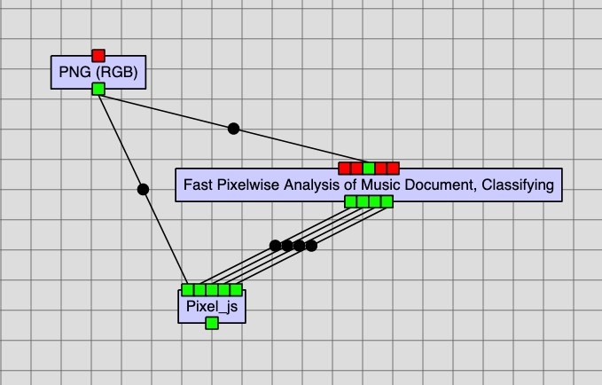

# Document Analysis

## Pixel.js

Pixel.js is used to classify pixels in an image into different layers (including an automatically generated background layer)
and outputting either the original image split into different layers or masks of those layers.
Different shapes or brushes can be used to classify pixels and patches into different layers.

The output format of the layers (mask or not) can be set through the Rodan job's settings.
Two more output ports must be specified than the number of layers to classify as two ports
are automatically used to output automatically generated background and selected regions
layers.

Optionally, existing layers can be loaded through input ports. One useful way to use this feature
is to use existing classifier models to generate layers of the source image to use in Pixel.js.
Errors would be made, but these can be corrected in Pixel.js and saves time compared to working
from scratch.





For more information on using Pixel.js, consult [the project's wiki](https://github.com/DDMAL/Pixel.js/wiki/).

## Patchwise Trainer

The [Patchwise Trainer](https://github.com/DDMAL/Calvo-classifier) job (actually named *Training model for
Patchwise Analysis of Music Document*) uses masks generated by Pixel.js as inputs, plus the source image itself.
Its outputs are the models for detecting background, music symbols, staff lines, and text.
There are four settings for this job:

1. Maximum number of samples per label;
2. Maximum number of training epochs;
3. Patch height; and
4. Patch width.

Note that these settings and the dimensions of the source image will change the memory requirements of the job.
As of the time of writing (July 2020), the job and GPU container itself can only use 45 GB on staging and 100 GB
on production.

### HPC Patchwise Trainer

[This job](https://github.com/DDMAL/hpc-fast-trainer) runs the trainer discussed above on the Compute Canada Cedar
cluster. It can only be run from staging as of now, but it provides access to more resources than available on the cloud.
Since resource limits must be specified a priori on the clusters, the following additional settings are present:

1. Maximum time to run in days, hours, and minutes;
2. The number of CPUs to allocate to the job (one GPU is allocated regardless of this value);
3. The email to send notifications to; and
4. The maximum memory the job will use in megabytes.
