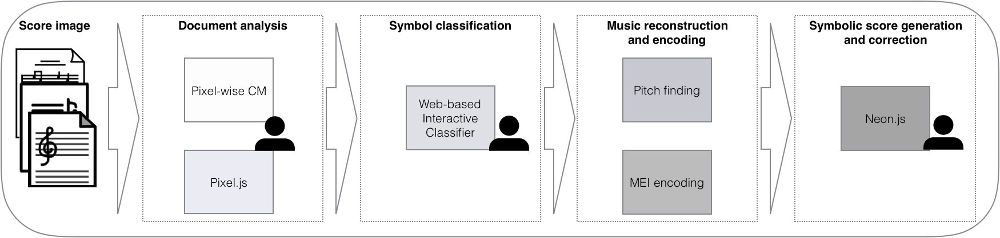

# Optical Music Recognition

Optical Music Recognition (OMR) is the transformation of images of music notation into digital representations with limited direct human involvement.
The workflow present in Rodan and discussed here is segmented into four stages[^1]:

1. Document Analysis
2. Symbol Classification
3. Music Reconstruction and Encoding
4. Symbolic Score Generation and Correction

<figure markdown="1">

<figcaption>
Stages of the OMR Process (Vigliensoni et al. 2019)
</figcaption>
</figure>

There are different jobs in Rodan meant for each job.

## Document Analysis

Document analysis involves certain generic image preprocessing jobs, such as those based on actions in [Pillow](https://python-pillow.org/) and [Gamera](https://gamera.informatik.hsnr.de/).
There is also the Pixel.js[^2] job, for separating regions of a source image into different layers (e.g., background, staff lines, text, and music elements), and
the Pixelwise and Patchwise trainer jobs[^3]. These jobs take the layers produced by Pixel and use them to train a model for
classifying other images.

## Symbol Classification

Classifier, Interactive Classifier, Biollante.

## Music Reconstruction and Encoding

With symbols grouped into broad categories (staff lines, text, music symbols) and then into more precise categories as necessary (C clefs, custodes, punctums, etc.) other values can be assigned to these symbols.
The jobs for this involve finding staves ([Miyao Staff Finding](https://github.com/DDMAL/gamera_rodan)), finding the pitches of musical elements ([Heuristic Pitch Finding](https://github.com/DDMAL/heuristic-pitch-finding)), and aligning a plaintext version of text on the page to the actual text glyphs ([Text Alignment](https://github.com/DDMAL/text_alignment)).

## Symbolic Score Generation and Correction

The [MEI Encoding](https://github.com/DDMAL/MEI_encoding) job takes the data from the previous jobs and encodes them into the [MEI](https://music-encoding.org) format.

Following MEI generation, [Neon](https://github.com/DDMAL/Neon) can be used to correct errors in the OMR process for square-notation manuscripts.

## Footnotes

[^1]: [G. Vigliensoni et al., “From image to encoding: Full optical music recognition of Medieval and Renaissance music,” presented at the Music Encoding Conference, University of Vienna, Vienna, Austria, May 2019.](https://github.com/music-encoding/music-encoding.github.io/raw/master/_conferences/2019/abstracts_mec2019/vigliensoni19from%20camera%20ready.pdf)
[^2]: [Z. Saleh, K. Zhang, J. Calvo-Zaragoza, G. Vigliensoni, and I. Fujinaga, “Pixel.js: Web-based Pixel Classification Correction Platform for Ground Truth Creation,” in Proceedings of the Twelfth IAPR International Workshop on Graphics Recognition, Kyoto, Japan, 2017.](https://doi.org/10.1109/ICDAR.2017.267)
[^3]: [J. Calvo-Zaragoza, G. Vigliensoni, and I. Fujinaga, “Pixelwise classification for music document analysis,” in 2017 Seventh International Conference on Image Processing Theory, Tools and Applications (IPTA), Nov. 2017.](https://doi.org/10.3390/app8050654)
